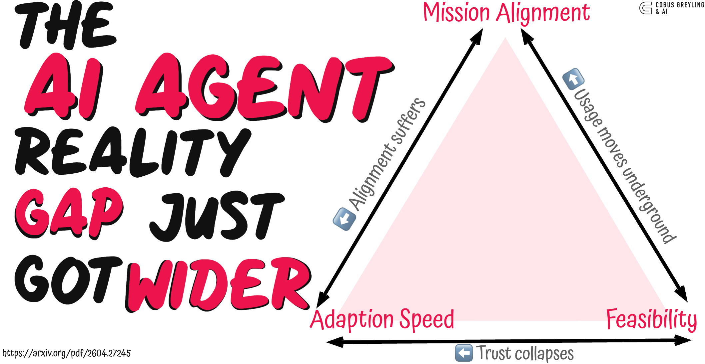

# The AI Agent Reality Gap Just Got Wider

*AI Adoption outran governance…*

**Author:** Cobus Greyling

*Source: <https://arxiv.org/pdf/2604.27245>*

---

A new study puts a frame around something I have written about before…the growing distance between how individuals use AI and how their institutions respond to it. The paper is aimed at education but the argument is not confined to it.

This repo holds the full article and supporting images.

## Contents

- [`article.md`](article.md) — the full article in markdown
- [`images/`](images/) — figures used in the article
  - `hero.png` — title graphic with the three-tension triangle
  - `diffusion.jpg` — institutions, cities and people, illustrating bottom-up AI diffusion
  - `three-tensions.png` — Mission Alignment / Adaptation Speed / Implementation Feasibility
  - `reality-gap-alt.jpg` — alternative layout of the reality-gap triangle

## Sections

- The Numbers that tell the story
- Power to the people: How LLMs flip the script on technology diffusion
- The reason agents widen the gap
- Gaps everywhere
- The three-tension framework — Implementation Feasibility, Adaptation Speed, Mission Alignment
- Tensions interact
- Deployments
- Not acting
- Thinking of the future…
